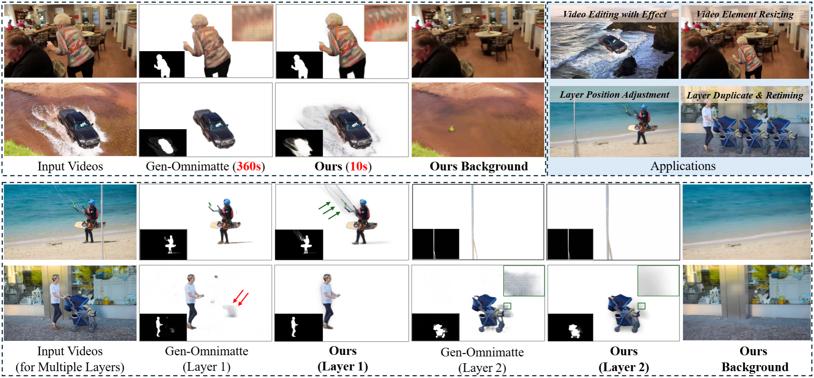
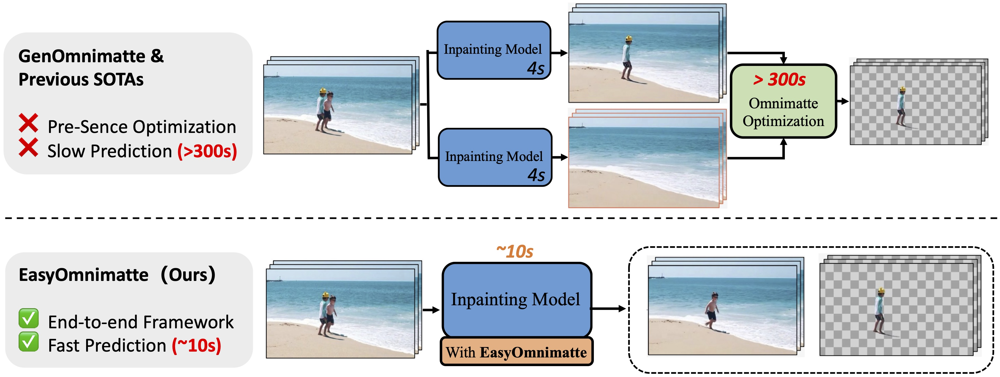

# EasyOmnimatte: Taming Pretrained Inpainting Diffusion Models for End-to-End Video Layered Decomposition

**Yihan Hu**, **Xuelin Chen**, **Xiaodong Cun**

GVC Lab, Great Bay University, Adobe Research

---

### 📢 News
- **[2025-12-07]**: The paper is currently under review. Code will be released soon!
- **[2025-12-01]**: We have released the arXiv version.

---

### 👀 Visualization Results

* Figure 1: EasyOmnimatte produces high-fidelity alpha mattes that accurately capture the associated effects, all within just seconds, representing a significant gain over existing state-of-the-art methods in both quality and efficiency.

* Figure 2: EasyOmnimatte is the first, end-to-end video omnimatte method, eliminating the need for slow, multi-stage optimization-based pipelines.
---

### ✅ TODO List

We are working on organizing the code. The following items will be released:

- [√] Release ArXiv paper.
- [√] Release Project Page.
- [ ] Release inference code (Demo).
- [ ] Release pretrained models (Checkpoints).
- [ ] Release training scripts and data preparation guidelines.

---

### 🚀 Getting Started (Coming Soon)

This repository is the official implementation of **EasyOmnimatte: Taming Pretrained Inpainting Diffusion Models for End-to-End Video Layered Decomposition**. 

The code is currently being organized and will be released upon acceptance. Please stay tuned!

### 📧 Contact
If you have any questions, please feel free to email [18281128hyh@gmail.com].
